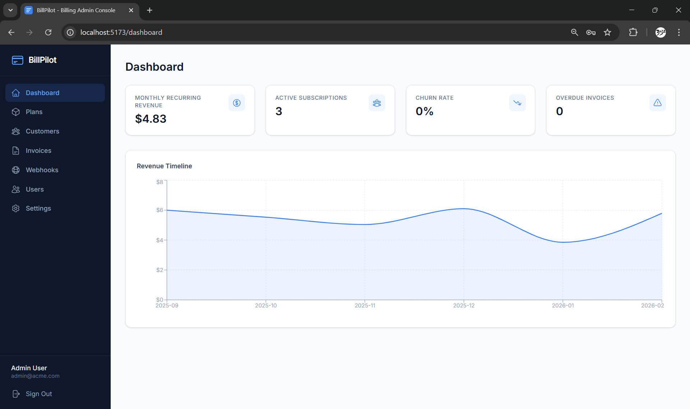
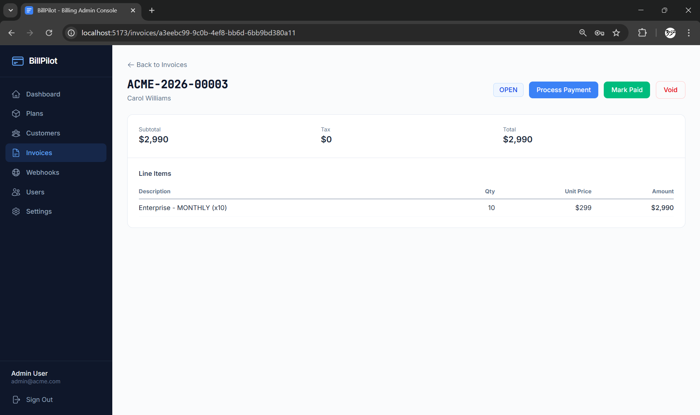

# BillPilot - SaaS Billing Admin Console

A full-stack SaaS billing platform built with Spring Boot and React.

## Tech Stack

- **Backend:** Spring Boot 3.4, Java 21, PostgreSQL 16, Flyway, JWT Auth, MapStruct
- **Frontend:** React 19, TypeScript, Vite 6, Tailwind CSS 4, TanStack Query 5
- **Infrastructure:** Docker Compose, Redis 7

## Screenshots

### Dashboard


### Invoice Detail


## Quick Start

```bash
# Start infrastructure
docker-compose up -d

# Start backend
cd backend
mvn spring-boot:run

# Start frontend
cd frontend
npm install
npm run dev
```

## Default Credentials

- **Email:** admin@acme.com
- **Password:** password123

## API Documentation

Visit `http://localhost:8080/swagger-ui.html` after starting the backend.

## Architecture

- Multi-tenant with organization-scoped data isolation
- JWT access tokens (15min) + refresh tokens (7 days)
- RBAC with 5 roles: OWNER, ADMIN, BILLING_MGR, SUPPORT, READ_ONLY
- UUID primary keys throughout
- Optimistic locking with version fields
